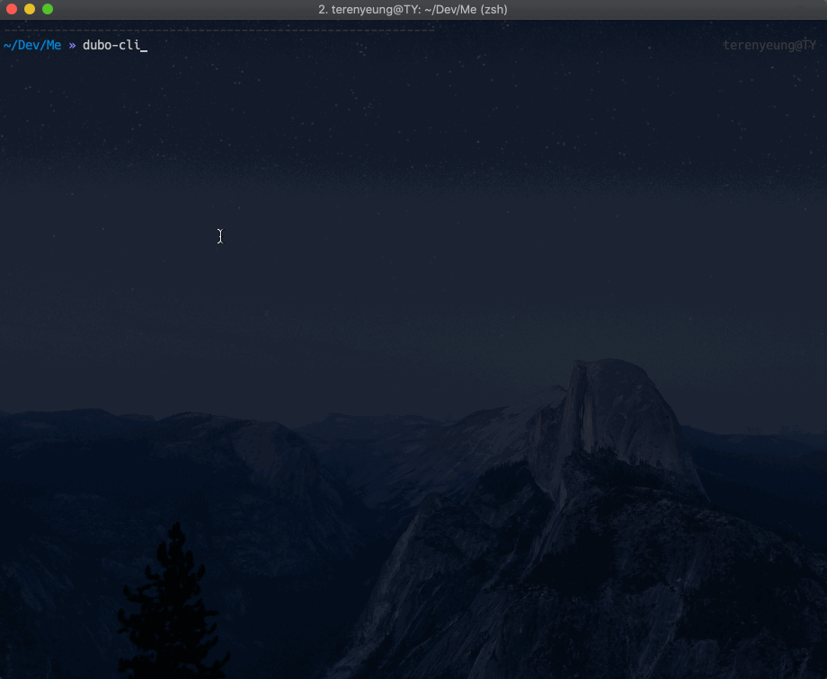

<p align="center">
  <a href="http://ant.design">
    
  </a>
</p>

<!-- <h1 align="center">Dubo CLI</h1> -->

<div align="center">

Dubo CLI is the Standard Tooling for Mobile Web Development.

  [](https://www.npmjs.com/package/dubo-cli) [](https://www.npmjs.com/package/dubo-cli) 


</div>



English | [简体中文](./README-zh_CN.md)

## ✨ Features

- Use webpack@4 as bundler and integrate features of dynamic import, decorator, code-spliting.
- Available to choose javascript or typescript as programming language.
- Select vue and react as one of UI library.
- Clearly structured directory.
- Integrate **font subsetting** workflow in webpack.
- Integrate **upyun auto upload** workflow in webpack.
- Support service worker configuration.
- Use node-gettext to implemente i18n plan.

## 📦 Install

```bash
npm install dubo-cli -g
```

## 🔨 Usage

Initialize one project:

```bash
$ dubo-cli init helloworld
```

And quickly create one page:

```bash
$ dubo-cli page user
```

Or quickly create one component:

```bash
$ dubo-cli component modal
```